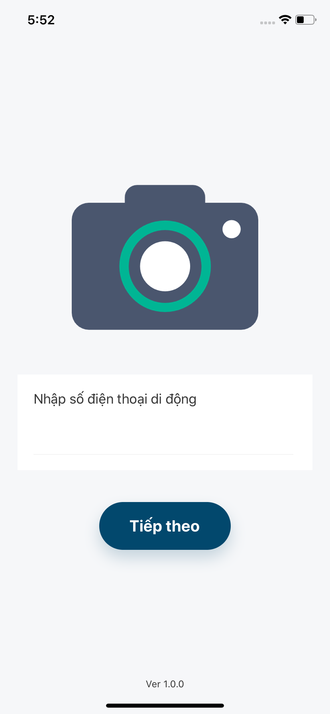
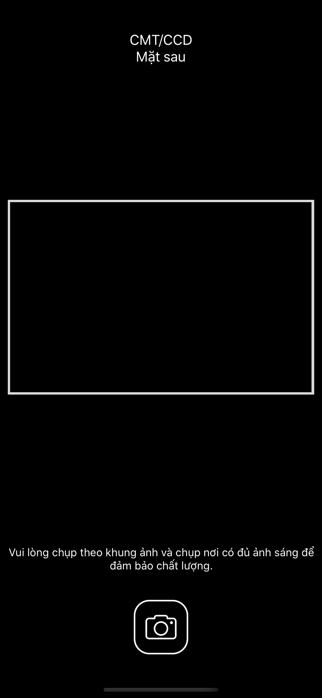

## REACT NATIVE CAMERA APP
A sample demo ORC app with Authentication and Camera features.

## INSTALLATION:
- Clone this repository:
 ```
$ git clone https://github.com/meobilivang/camera-react-native-app.git
 ```
## SET UP DEVELOPEMENT ENVIRONMENT:
**In this project, I am using React Native's CLI instead of Expo CLI**

**Setting up process differs by your OS (iOS or Android), review this Doc for more specific guidelines**:https://reactnative.dev/docs/environment-setup/

Please ensure that you have the below items to start the application:
- NodeJS
- Android Studio & Java JDK & Android SDK (Run on Android emulators)
- XCode & CocoaPods (Run on iOS emulators, only available on MacOS)

## DEPENDENCIES:
- **react**: 16.9.0,
- **react-native**: 0.63.3,
- **react-native-camera**: 3.40.0,
- **react-native-device-info**: 6.0.2,
- **react-native-gesture-handler**: 1.2.1,
- **react-native-screens**: 2.11.0,
- **react-navigation**: 3.11.0

## BUILD AND RUN:
- Install all dependencies: (I use NPM for this project)
```
$ npm install 
```
- Link dependencies: 
```
$ npx react-native link
```
- (For iOS) Install Pods (dependencies for iOS):
```
$ cd ios && pod install
```

- Start Metro Bundler:
```
$ npx react-native start
```

- (iOS) Run React-Native App on emulator:
```
$ npx react-native run-ios
```

- (Android) Run React-Native App on emulator/physical devices:
```
$ npx react-native run-android
```

### IN-APP SCREENSHOTS:





# Futher updates coming in future ! (Including Back-end)
